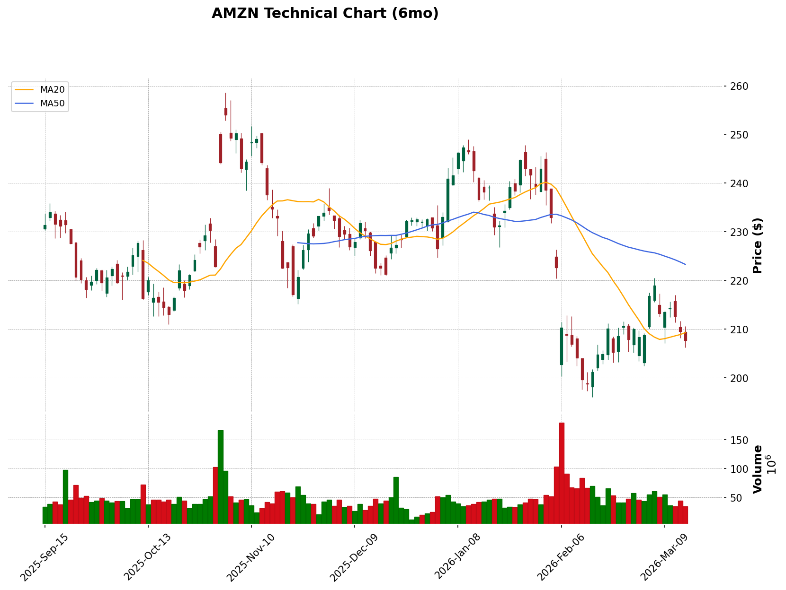

# Technical Analysis Report: AMZN (2026-03-14)

## 📊 Technical Analysis Chart

> **Ticker**: AMZN | **Price**: $207.67 | **Sector**: Consumer Cyclical (Internet Retail) | **Market Cap**: $2.23T | **Beta**: 1.42
> **Data Sources**: yahoo_finance, web_search (nasdaq.com, federalreserve.gov, bls.gov, marketrebellion.com)
> **Analysis Date**: 2026-03-14

---

## 📅 Upcoming Event Calendar

| Date | Event | Expected Impact | Technical Relevance |
|:---|:---|:---:|:---|
| 2026-03-14 | Monthly OPEX (Mar expiration) | 🟡 Medium | Max Put OI at $207.50 may act as price magnet; pin risk elevated |
| 2026-03-17~18 | FOMC Rate Decision + Press Conference | 🔴 High | Market-wide volatility catalyst; current weak structure vulnerable to gap |
| 2026-03-18 | PPI Data Release (Feb) | 🟡 Medium | Coincides with FOMC day; double volatility catalyst |
| 2026-04-10 | CPI Data Release (Mar) | 🟡 Medium | Market sentiment shift, may impact sector rotation |
| 2026-04-23~30 | Earnings Release (Est., Unconfirmed) | 🔴 High | IV expansion expected ~2 weeks prior; current setup may gap on report |

> ⚠️ **Event-Technical Interaction**: FOMC on Mar 17-18 is the nearest high-impact event — occurring immediately after OPEX. The current technical setup (price pinned near max put OI at $207.50) is unlikely to resolve directionally before the FOMC catalyst. Expect elevated volatility and potential gap moves post-FOMC. The failed bounce from $218.94 (Mar 5) leaves the stock in a vulnerable position heading into the event.

---

## I. Layer 1 Framework Overview (Foundation Framework)

Based on the "Trend > Cost > Participation > Capital Flow" hierarchical analysis:

| Analysis Item | Tool | Current State | Consistency |
|:---|:---|:---|:---:|
| 1️⃣ Trend Direction | Three MAs (20/50/200 MA) | Bearish alignment: Price < SMA20 ($209.29) < SMA50 ($223.31) < SMA200 ($224.70) | ⚠️ |
| 2️⃣ Cost Zone Position | Volume Profile / POC | Below POC ($205.50) area — price at $207.67 near POC, slightly above | ✅ |
| 3️⃣ Participation | Volume | Declining volume on Mar bounce ($35-51M) vs. Feb selloff ($66-179M) — weak participation | ⚠️ |
| 4️⃣ Capital Flow Direction | OBV | OBV declining (320M vs. 432M 4 days ago) — capital outflow continues | ⚠️ |

**Extended Analysis (Market & Microstructure)**:

| Analysis Item | Key Observation | Current State |
|:---|:---|:---|
| 📊 Market Correlation | Stock vs SPY/QQQ | Trend-aligned decline, but AMZN underperforming (AMZN -10.03% YTD vs SPY -2.88%) |
| 🎲 Institutional Cost | POC / Value Area | Institutions near cost — price at $207.67, POC at ~$205.50 |
| 🎲 Position Concentration | Volume Profile shape | Bimodal — heavy cluster $200-$215 (recent) and $230-$245 (prior trading) |
| 🎲 Turnover Trend | Recent vs historical average | Active turnover — daily ~0.32%, elevated from post-selloff repositioning |

**Framework Summary**: Three of four pillars bearish (trend, participation, capital flow); only cost positioning is neutral as price hovers near POC. Structure is in bearish alignment. AMZN is trend-aligned with market weakness but underperforming significantly. Institutional control is medium — bimodal distribution signals standoff between pre- and post-selloff positioning.

---

## II. Weekly Candlestick Analysis (Long-Term Trend)

### Trend Overview
- Weekly trend: **Bearish** — in a clear downtrend since the $254 high (Nov 2025)
- 200MA: $224.70 (Flat/slightly rising, long-term resistance — price 7.6% below)
- 50MA: $223.31 (Falling, medium-term resistance — price 7.0% below)

### Key Price Levels
- Weekly resistance: $218 - $225 (38.2%-50% Fibonacci + MA cluster)
- Weekly support: $196 - $200 (Feb 2026 swing low zone)

### Pattern Observations
The weekly chart shows a descending channel formation since the $254 peak. The Feb 2026 selloff created a sharp V-bottom at $196, followed by a weak bounce that stalled at $218.94. The current weekly candle is a bearish continuation candle, indicating the bounce has failed.

**Weekly Key Indicator Summary:**

| Indicator | Value | Trend Reading |
|:---|:---|:---|
| 200MA | $224.70 | Long-term resistance (price 7.6% below) |
| 50MA | $223.31 | Medium-term resistance (price 7.0% below) |
| This Week's Close | $207.67 | Below all major MAs |
| This Week's Volume | 238.7M | Above average — distribution week |

### Weekly Technical Confirmation (from `yf technicals --interval 1wk`)

| Weekly Indicator | Value | Signal | vs. Daily |
|:---|:---|:---|:---:|
| Weekly RSI (14) | 42.76 | Bearish, approaching oversold territory | Aligned |
| Weekly MACD | DIF: -3.25, DEA: 0.21, Hist: -3.46 | 🔴 Bearish crossover — MACD crossed below signal | Aligned |
| Weekly SMA(20) vs SMA(50) | SMA20 ($226.72) > SMA50 ($218.45) — Above but converging | Bearish convergence approaching death cross | Aligned |
| Weekly Bollinger Band Width | 25.11% | Expanded — elevated volatility regime | — |

> 💡 **Weekly-Daily Alignment**: Weekly and daily signals are fully aligned in bearish direction. Weekly MACD just made a bearish crossover (histogram deeply negative at -3.46), confirming this is not merely a daily-timeframe pullback but a weekly-scale trend reversal. The weekly Bollinger Band width of 25.11% indicates a high-volatility regime where mean-reversion strategies carry elevated risk.

---

## III. Daily Candlestick Analysis (Medium-Term Structure)

### Moving Average Alignment
- 20MA: $209.29 (Falling — immediate resistance)
- 50MA: $223.31 (Falling — major overhead resistance)
- 200MA: $224.70 (Flat — convergence with 50MA at $223-$225 zone)
- Alignment state: **Bearish** — Price < 20MA < 50MA ≈ 200MA

### Support & Resistance Analysis

| Type | Price Zone | Strength | Description |
|:---|:---|:---|:---|
| Resistance 1 | $209 - $210 | 🟡 Moderate | 20MA + 23.6% Fibonacci retracement |
| Resistance 2 | $218 - $220 | 🔴 Strong | 38.2% Fibonacci + recent failed bounce high + gap fill zone |
| Resistance 3 | $223 - $225 | 🔴 Strong | 50MA / 200MA convergence + 50% Fibonacci |
| Support 1 | $205 - $207 | 🟡 Moderate | Volume Profile POC zone + max put OI |
| Support 2 | $200 - $202 | 🔴 Strong | Round number + VAL + psychological support |
| Support 3 | $196 | 🔴 Strong | Feb 2026 swing low — critical must-hold level |

### Gap Analysis

**Recent Gaps Detected** (past 3 months):

| Date | Gap Type | Gap Size | Direction | Volume | Filled? | Significance |
|:---|:---|:---|:---:|:---:|:---:|:---|
| 2025-10-31 | Earnings Breakaway | 6.8% ($228.44→$243.98) | Up | Above avg (166M) | ✅ Yes (Nov 18) | Post-earnings euphoria, fully reversed |
| 2026-02-03 | Breakdown | 2.4% ($226.31→$231.82) | Down | Above avg (104M) | ❌ No | **Unfilled** — acts as overhead resistance |
| 2026-02-04 | Continuation | 4.1% ($211.44→$220.38) | Down | Very high (179M) | ✅ Yes (Mar 5) | Panic selling gap, filled on Mar 5 bounce |

**Unfilled Gaps Acting as S/R**:
- Gap at $226.31 - $231.82 (Feb 3) — acting as **resistance**. This gap represents the "distribution zone" where selling pressure overwhelmed buyers. Price must clear this zone to negate the bearish structure.

**Gap Fill Tendency**: AMZN tends to fill gaps within 2-4 weeks (mean-reverting) based on recent behavior, though the Feb 3 gap remains unfilled after 5+ weeks, suggesting strong overhead supply.

> 💡 **Gap-Technical Interaction**: The unfilled gap at $226.31-$231.82 overlaps with the 50% Fibonacci retracement ($225.00) and the 50MA/200MA convergence zone ($223-$225), creating a **triple-confluence resistance zone** at $223-$232 that will be very difficult to break without significant catalysts.

---

### Fibonacci Levels

**Swing Reference**: Swing high $254.00 (2025-11-03) → Swing low $196.00 (2026-02-10)

| Fibonacci Level | Price | Type | Confluence |
|:---|:---|:---|:---|
| 23.6% | $209.69 | Retracement | Near 20MA ($209.29) — immediate resistance cluster |
| 38.2% | $218.16 | Retracement | Near Mar 5 bounce high ($218.94) — validated as resistance |
| 50.0% | $225.00 | Retracement | Near 50MA/200MA convergence zone |
| 61.8% | $231.84 | Retracement | Within unfilled gap zone ($226.31-$231.82) |
| 78.6% | $241.59 | Retracement | Pre-selloff consolidation zone |
| 127.2% | $269.78 | Extension | Bullish extension target 1 |
| 161.8% | $289.84 | Extension | Bullish extension target 2 |

> 💡 **High-Confluence Zones**:
> - **$209-$210**: 23.6% Fib ($209.69) + 20MA ($209.29) — current battleground. Failure to reclaim this zone confirms continued weakness.
> - **$218-$220**: 38.2% Fib ($218.16) + recent bounce high ($218.94) + filled gap top ($220.38) — proven resistance.
> - **$223-$232**: 50%-61.8% Fib ($225-$232) + 50MA/200MA + unfilled gap — **fortress resistance zone**.
> - **$196-$200**: Swing low + round number + VAL — critical support. A break below opens path to lower extension levels.

### Momentum Indicator Combination

**Indicator combination selected for AMZN (Mega-cap Internet Retail / High-Beta Tech)**: Emphasis on momentum oscillators and volume confirmation given the high-beta, high-volume nature of the stock.

| Indicator Type | Selected Indicator | Value | Signal |
|:---|:---|:---|:---|
| Trend Indicator | MACD (12,26,9) | DIF: -2.51, DEA: -3.35, Hist: +0.84 | 🟡 Bearish but histogram improving — momentum deceleration |
| Oscillator | RSI (14) | 41.33 | 🟡 Bearish territory but not oversold (>30) |
| Oscillator | KDJ (9,3,3) | K: 47.24, D: 59.57, J: 22.57 | 🔴 K below D — bearish; J at 22.57 approaching oversold |
| Volatility Indicator | Bollinger Bands (20,2) | Mid: $209.29, Width: 9.42%, %B: 0.42 | 🟡 In lower half of band — neutral to bearish |
| Volume Indicator | MFI (14) | 45.33 | 🟡 Below 50 — mild money outflow |
| Capital Flow Indicator | Net Volume Bars | Net Vol: -13.6M | 🔴 Net selling on last session |
| Volatility Indicator | ATR (14) | $5.62 | 🟡 Normal volatility — typical daily range ~2.7% |

---

## IV. Market Benchmark & Stock Comparison (Market Context)

### 4.1 Market Trend Overview

| Market Index | Current Price | Trend | 20MA | 50MA | Recent Change |
|:---|:---|:---:|:---:|:---:|:---:|
| **SPY** (S&P 500) | $662.29 | 🟡 Pullback within uptrend | Below | Below | -1.50% (1W) |
| **QQQ** (Nasdaq 100) | $593.72 | 🟡 Pullback within uptrend | Below | Below | -1.01% (1W) |
| **XLY** (Consumer Cyclical) | $110.86 | 🔴 Bearish | Below | Below | -3.13% (1W) |

**Overall Market Assessment**: 🟡 Neutral — Market indices (SPY/QQQ) are pulling back but still above 200MA. However, Consumer Cyclical sector (XLY) is in a more pronounced bearish trend, below all major MAs. Risk-off rotation is impacting AMZN's sector disproportionately.

### 4.2 Stock vs. Market Comparison

**Comparable Period Returns:**

| Ticker | 1W Return | 1M Return | 3M Return | YTD Return | vs. Market |
|:---|:---:|:---:|:---:|:---:|:---:|
| AMZN | -2.60% | +1.76% | -10.40% | -10.03% | Baseline |
| SPY | -1.50% | -4.29% | -3.39% | -2.88% | AMZN lagging by -7.15% (3M) |
| QQQ | -1.01% | -3.16% | -5.28% | -3.35% | AMZN lagging by -6.68% (3M) |
| XLY | -3.13% | -5.86% | -7.21% | -7.16% | AMZN lagging sector by -2.87% (3M) |

**Estimated Beta**: 1.42 — AMZN amplifies market moves by ~42%

### 4.3 Trend-Aligned / Counter-Trend Assessment

| Comparison | Stock | Market (SPY) | Consistency |
|:---|:---:|:---:|:---:|
| Short-term trend (4H) | Down | Down | Same ✅ |
| Medium-term trend (Daily) | Down | Down | Same ✅ |
| Long-term trend (Weekly) | Down | Neutral/Down | Same ✅ |

**Overall Assessment**: 🔴 **Trend-aligned decline** — AMZN is declining in sync with the broader market but with significantly greater magnitude (-10.03% YTD vs -2.88% SPY), reflecting both market weakness and stock-specific headwinds. Beta of 1.42 explains part of the amplification.

### 4.4 Sector Relative Strength

| Ticker | 3M Performance | Relative Strength | Reading |
|:---|:---:|:---:|:---|
| AMZN | -10.40% | — | Baseline |
| XLY (Consumer Cyclical) | -7.21% | Lagging by -3.19% | 🔴 Sector laggard |
| SPY (Market) | -3.39% | Lagging by -7.01% | 🔴 Significant market underperformance |

**Sector Positioning**: 🔴 **Sector laggard** — AMZN is underperforming even its own weak sector (XLY) by 3.19% over 3 months.

### 4.5 Sector Rotation Overview

**Cross-Sector Performance Ranking** (1W / 3M):

| Rank | Sector ETF | Sector | 1W Return | 3M Return | Capital Flow Signal |
|:---:|:---|:---|:---:|:---:|:---|
| 1 | XLE | Energy | +2.00% | +26.01% | 🟢 Strong Inflow — at 52W high |
| 2 | XLP | Consumer Staples | -1.21% | +9.20% | 🟢 Defensive Inflow |
| 3 | XLI | Industrials | -3.11% | +5.87% | 🟡 Fading momentum |
| 4 | XLK | Technology | -0.36% | -7.88% | 🔴 Outflow |
| 5 | XLV | Healthcare | -1.91% | -1.13% | 🟡 Neutral |
| 6 | XLY | Consumer Cyclical | -3.13% | -7.21% | 🔴 Outflow |
| 7 | XLF | Financials | -3.32% | -8.96% | 🔴 Outflow |

**Current Rotation Phase**: 🔴 **Risk-Off** — Capital rotating out of growth/cyclical sectors (Tech -7.88%, Consumer Cyclical -7.21%, Financials -8.96%) into defensive/value sectors (Energy +26.01%, Staples +9.20%). This is a classic late-cycle or risk-off rotation pattern.

**Implication for AMZN**: AMZN's sector (XLY) ranked #6 out of 7 — sector rotation **creates significant headwinds** for the stock's technical setup. Until sector rotation reverses (money flowing back into growth/cyclical), AMZN's recovery attempts are likely to face selling pressure.

---

## V. 4-Hour Candlestick Analysis (Short-Term Momentum)

### Short-Term Trend
- **Short-term trend**: Bearish — declining from Mar 5 high ($218.94)
- **4H MA alignment**: Bearish — price below all EMA ribbons (EMA8: $211.20, EMA13: $211.50, EMA21: $212.79)
- **Key levels**: Support $206 / Resistance $210-$211
- **Market correlation**: 4H chart vs QQQ — Highly correlated in downward direction

### VWAP Analysis (Institutional Execution Benchmark)

| Metric | Value | Reading |
|:---|:---|:---|
| **60-Day VWAP** | $219.98 | Long-term institutional avg cost — price 5.6% below |
| **20-Day VWAP** | $209.06 | Recent institutional cost benchmark |
| **Price vs. 20-Day VWAP** | Below ($207.67 vs $209.06) | Intraday bearish bias — institutions buying above current levels |
| **VWAP Slope** | Falling | Selling pressure dominating |

> **Data Note**: VWAP calculated from `yf history AMZN 60d --interval 1h` (~407 hourly bars).

### Volume Profile & VWAP Analysis

#### VWAP Bands (estimated from 20-day VWAP)

| Band | Price Level |
|:---|:---|
| **VWAP** | $209.06 |
| **+1σ Band** | $214.68 |
| **+2σ Band** | $220.30 |
| **-1σ Band** | $203.44 |
| **-2σ Band** | $197.82 |

#### Volume-at-Price Distribution (60-day, Support/Resistance Identification)

| Price Zone | Volume Level | Node Type | Significance |
|:---|:---|:---|:---|
| $202.50 - $207.50 | 🟢 Very High (414.3M) | **HVN (POC zone)** | Strongest institutional cost concentration; primary support zone |
| $205.00 - $210.00 | 🟢 High (339.6M) | HVN | Current price zone — heavy institutional presence |
| $237.50 - $245.00 | 🟢 Moderate (254.0M) | HVN | Pre-selloff institutional cost — overhead supply from trapped longs |
| $215.00 - $220.00 | 🔴 Low (56.3M) | **LVN** | Price will move rapidly through this zone if tested |
| $220.00 - $227.50 | 🔴 Low (126.9M) | LVN | Low-volume gap zone — rapid transit area |

> **Key S/R from Volume Profile**: Primary support at $202.50-$207.50 (POC cluster, heaviest 60-day volume concentration). Primary resistance at $237.50-$245.00 (HVN from pre-selloff trading). **Critical LVN gap between $215-$227** — if price breaks above $215, it could move rapidly toward $227+; conversely, this thin zone offers little support on the way down.

#### Volume Trend Confirmation for Price Moves

| Price Move | Volume Behavior | Confirmation | Assessment |
|:---|:---|:---|:---|
| Feb selloff $232→$196 | Very high (66-179M daily) | ✅ Confirmed | Heavy distribution — institutional selling |
| Mar bounce $196→$219 | Moderate (35-61M daily) | ❌ Not confirmed | Suspect — rising on declining volume vs. selloff |
| Mar pullback $219→$207 | Moderate (34-54M daily) | ✅ Confirmed | Volume expanding on decline — selling resuming |

> **Volume-Price Verdict**: Price action is **not** supported by bullish volume. The Mar bounce lacked volume conviction compared to the Feb selloff, and the current pullback shows increasing volume — a classic failed-bounce pattern. Distribution continues.

### Short-Term Momentum Indicator Combination

**Short-term indicator combination suited for AMZN (High-Beta Mega-Cap)**:

| Indicator | Period Setting | Current Value | Short-Term Signal |
|:---|:---|:---|:---|
| KDJ | (9,3,3) | K: 47.24, D: 59.57, J: 22.57 | 🔴 K below D — sell signal; J oversold |
| RSI | (14) | 41.33 | 🟡 Neutral-bearish, not yet oversold |
| MACD | (12,26,9) | Histogram: +0.84 | 🟢 Histogram improving — momentum deceleration |
| Bollinger Bands | (20,2) | %B: 0.42 | 🟡 Lower half — mild bearish bias |

**Indicator Composite Assessment**:
- KDJ's J-line at 22.57 is approaching oversold territory, suggesting a short-term bounce may materialize near current levels
- MACD histogram turning positive (+0.84, up from -1.07 three days ago) indicates selling momentum is decelerating
- However, RSI at 41.33 is not yet oversold — room for further downside before a meaningful reversal signal
- Mixed signals suggest consolidation/basing at $205-$210 before the next directional move (likely catalyzed by FOMC)

### Short-Term Entry/Exit Reference

| Condition | Price | Criteria | Indicator Confirmation |
|:---|:---|:---|:---|
| 🟢 Short-term long entry | $200 - $203 | Test of VAL + -1σ VWAP band | KDJ J < 10 + RSI < 30 |
| 🔴 Short-term short entry | $215 - $218 | Failed retest of 38.2% Fib | KDJ K > 80 + RSI > 65 |
| ⏹️ Stop-loss (long) | $195 | Below Feb swing low | 1.5×ATR = $8.43 from $203 entry |

---

## V-B. Multi-Timeframe Divergence Summary

### Cross-Timeframe Overview

| Dimension | Weekly | Daily | 4H | Alignment |
|:---|:---:|:---:|:---:|:---:|
| **Trend Direction** | Bear | Bear | Bear | ✅ Aligned |
| **MA Alignment** | Bearish (below all MAs) | Bearish (below 20/50/200) | Bearish (below EMA ribbon) | ✅ Aligned |
| **RSI** | 42.76 | 41.33 | ~42 (est.) | ✅ All neutral-bearish |
| **MACD** | 🔴 Bear (fresh crossover) | 🟡 Bear but improving hist | 🟡 Improving | ⚠️ Daily/4H diverging from Weekly |
| **vs. SPY/QQQ** | Underperforming | Underperforming | Aligned decline | ✅ Aligned |

### Key Conflicts & Resolution Bias

- **Dominant timeframe**: Weekly — the fresh weekly MACD bearish crossover (hist: -3.46) carries more weight than the daily/4H histogram improvement
- **Conflict identified**: Daily/4H MACD histogram improving while Weekly MACD just crossed bearish — this suggests the recent daily bounce was a counter-trend rally within a new weekly downtrend. The daily improvement is likely a dead-cat bounce, not a trend reversal.
- **Resolution bias**: 🔴 **Downward resolution** — Weekly bearish crossover dominates. The daily/4H improvement may produce a short-term bounce to $210-$215, but the path of least resistance is lower. Probability favors a retest of $196-$200 support within the next 2-4 weeks unless FOMC provides a strong bullish catalyst.

---

## VI. Market Microstructure Analysis (Chip Analysis)

### 6.1 Volume Profile Deep Analysis

**Volume Distribution Overview** (past 60 days):

| Metric | Price Level | Description |
|:---|:---|:---|
| **POC** (Highest volume) | **$205.50** | Primary institutional cost zone — heaviest 60-day volume |
| **VAH** (Value Area High) | **$212.50** | Upper boundary of recent high-volume trading |
| **VAL** (Value Area Low) | **$200.00** | Lower boundary — critical support |
| **Value Area Width** | $12.50 | Moderate — reflects post-selloff consolidation range |

**Volume Distribution Shape**: **Bimodal** — Two distinct clusters:
1. **$200-$215** (Recent post-selloff accumulation zone, ~67% of 60-day volume)
2. **$230-$245** (Pre-selloff distribution zone, ~33% of 60-day volume)

**High Volume Nodes (HVN) / High-Volume Price Bands**:

1. $202.50 - $210.00: ~62% of recent volume, **primary support/accumulation zone**
2. $237.50 - $245.00: ~14% of volume, overhead supply from trapped longs

> 💡 **Institutional Cost Zone Estimate**: Current price ($207.67) is **slightly above** POC ($205.50), indicating institutions who accumulated during the Feb selloff are near breakeven to slightly profitable. The 60-day VWAP at $219.98 suggests longer-duration institutional positions are significantly underwater.

### 6.2 Turnover Analysis

| Metric | Value | Reading |
|:---|:---|:---|
| Daily Turnover Rate | 0.32% (34.2M / 10.73B shares) | Normal — typical for mega-cap |
| 5-Day Average Turnover | 0.40% (~43M daily avg) | Slightly elevated from recent volatility |
| Turnover Change | Declining from Feb peak (1.67% on Feb 4) | Positions settling after selloff |

**Position Stability Assessment**:
- Recent turnover declining from the Feb 4 peak (179M shares = 1.67%), suggesting positions are settling post-selloff
- Large institutional holders (Vanguard 8%, BlackRock 7%, State Street 4%) reported minimal changes in Q4 2025 filings
- Notable: JP Morgan reduced holdings by 56% in Q4 2025 — significant institutional de-risking signal

### 6.3 Institutional Control Assessment

| Dimension | State | Description |
|:---|:---|:---|
| Volume Profile Concentration | Medium | Bimodal distribution — standoff between post-selloff accumulators and trapped longs |
| Turnover Trend | Falling | Positions settling after Feb selloff — stabilization in progress |
| Price vs. POC | Slightly Above ($207.67 vs $205.50) | Recent accumulators near breakeven — they may defend POC |

**Overall Assessment**: 🟡 **Institutional control level: Medium** — The bimodal Volume Profile indicates a "standoff" between two institutional camps: (1) those who accumulated at $200-$210 during the Feb selloff, and (2) those still holding positions from $230-$245 who are significantly underwater. This standoff creates a wide trading range ($200-$220) with neither side having clear control.

### 6.4 Short Interest & Technical Signal Cross

| Metric | Value | Signal |
|:---|:---|:---|
| Short % of Float | **0.84%** | 🟢 Very Low — minimal short pressure |
| Short Ratio (Days to Cover) | **1.31 days** | 🟢 Normal — no squeeze potential |
| Shares Short | 81.89M (up from 71.85M prior month) | 🟡 Increasing (+14% MoM) |
| Date Short Interest | 2026-02-27 | Most recent available |

**Technical Signal Cross**:
- Short interest is very low (0.84%) despite the steep selloff, indicating bears are not heavily positioned for further downside — this removes short squeeze as a potential catalyst
- The 14% month-over-month increase in short interest (71.85M → 81.89M) aligns with the bearish OBV signal, suggesting directional conviction is growing among bears
- However, the absolute level remains very low for a stock of this size, meaning any recovery is not at risk of a short squeeze accelerating it

> 📎 **Cross-Reference**: For complete short interest analysis (squeeze risk scoring, borrow rate, 3-month trends) and institutional positioning (13F multi-quarter, smart money direction), see the `us_insider` Chips Analysis Report.
>
> ⚠️ **Data Limitation**: Short interest updates bi-monthly. Data as of 2026-02-27.

---

## VII. Market Structure Assessment (Market Structure)

### 7.1 Liquidity State Determination

**Current State**: 🏜️ **Liquidity Contraction**

**Assessment Basis**:
- Recent breakout success rate: **Low** — Mar 5 breakout to $218.94 immediately reversed
- Trend continuation: **Weak** — rallies limited to 2-3 days before fading
- False breakout frequency: **High** — Mar 5 bounce was a false breakout above 38.2% Fib
- Volume-price alignment: **Divergent** — bounces on lower volume, declines on higher volume

### 7.2 Market Regime Analysis

| Assessment Item | State | Description |
|:---|:---|:---|
| Overall Regime | 🔴 Transition → Contraction | Trending from volatile selloff to compressed range |
| Trend Efficiency | Low | Directional pushes quickly reversed |
| Reversion Frequency | High | Price repeatedly pulled back to $205-$210 zone |
| Continuation Ability | Weak | Breakout above $215 on Mar 5 immediately failed |

### 7.3 Payout Efficiency Observations

**Recent Price Behavior Analysis** (past 15 daily candles, Feb 24 - Mar 13):
- Breakout success rate: ~20% (1/5 breakout attempts succeeded briefly)
- Average trend continuation duration: 2-3 candles before reversal
- False breakout / bidirectional sweep frequency: **High** — price swept to $218.94 then reversed to $207.67

### 7.4 Strategy Fit Recommendations

**Suitable Strategy Type**: **Structural positioning** — Wait for key level tests

**Specific Recommendations**:
- ✅ Recommended: "Position at key support levels ($200-$203) with tight stops below $195; or fade failed bounces at $215-$218"
- ⚠️ Caution: "Breakout chasing — low success rate in current regime"
- ❌ Avoid: "FOMO entries on 1-2 day bounces; selling puts at current levels (FOMC risk)"

---

## VII-B. Options / IV Analysis

### Options Market Observations

| Item | Value | Reading |
|:---|:---|:---|
| ATM IV (210 strike avg) | ~27% | 🟡 Normal — mid-range of 52W IV (23%-63%) |
| IV Rank (est.) | ~15% | 🟢 Low — near bottom of 52W range |
| Put/Call OI Ratio | 1.24 (11,672P / 9,404C) | 🟡 Slightly put-heavy — mild bearish sentiment |
| Max Call OI Strike | **$215.00** (3,138 OI) | Overhead "magnetic" resistance |
| Max Put OI Strike | **$207.50** (2,723 OI) | Downside "magnetic" support |
| IV Skew (25Δ Put - Call) | ~5% (Put IV ~30% vs Call IV ~25%) | Positive — moderate downside fear/hedging |
| 30-Day Call IV | 33% | Normal range (52W: 23-63) |

**Options-Technical Confluence**:
- Max Call OI at $215 aligns with daily EMA cluster ($211-$213) and LVN zone — confluence resistance
- Max Put OI at $207.50 aligns with current price ($207.67) and POC ($205.50) — price is pinned near max put OI heading into OPEX (Mar 14)
- Low IV Rank (~15%) suggests options are cheap — favorable for buying options strategies ahead of FOMC (Mar 17-18)
- OPEX pin risk: With price sitting almost exactly on the $207.50 max put strike, expect price to be "magnetically" attracted to this level through OPEX

> 📎 **Cross-Reference**: For options **flow** analysis (unusual activity, sweep/block trades, directional positioning, P/C ratio trends), see the `us_insider` Chips Analysis Report.

---

## VIII. Comprehensive Assessment & Trading Recommendations

### Technical Summary
- 🔴 Overall trend: **Bearish** — price below all major MAs in full bearish alignment across Weekly/Daily/4H
- 📊 Market correlation: **Trend-aligned decline** — AMZN declining with market, but underperforming significantly (AMZN -10.03% vs SPY -2.88% YTD)
- 🏜️ Market structure: **Liquidity Contraction** — breakout attempts failing, rallies short-lived
- 🎲 Microstructure state: **Institutional control medium** — bimodal VP with standoff between post-selloff accumulators and trapped longs
- Key observations:
  - Weekly MACD just made bearish crossover — new intermediate-term sell signal
  - Price trapped between POC ($205.50) and 20MA ($209.29)
  - FOMC on Mar 17-18 is the dominant near-term catalyst
  - Sector rotation strongly risk-off — Consumer Cyclical (#6/7 sectors)
  - Short interest very low (0.84%) — no squeeze potential

### Market & Sector Positioning
- **Market trend**: SPY pulling back but still above 200MA; market in correction mode, not bear market
- **Stock relative strength**: vs. market — **Lagging by 7.15%** (3M basis)
- **Sector positioning**: Within Consumer Cyclical (XLY), performing as **sector laggard** (-10.40% vs -7.21% for XLY over 3M)
- **Trend alignment**: 🔴 **Trend-aligned decline with underperformance**
  - AMZN's beta of 1.42 amplifies market moves, but the underperformance exceeds beta-adjusted expectations, suggesting stock-specific selling pressure

### Microstructure Summary
- **Institutional cost zone**: POC $205.50, current price $207.67 — slightly above; recent accumulators near breakeven
- **Position concentration**: Bimodal (post-selloff cluster $200-$215 vs. trapped-long cluster $230-$245), Value Area $200-$212.50
- **Turnover state**: Settling from Feb peak — stabilization in progress but not complete
- **Key risk**: JP Morgan's -56% position reduction signals institutional de-risking; could be a leading indicator of further rebalancing

### Market Structure Summary
Current regime is 🏜️ **Liquidity Contraction** — characterized by low breakout success rate, rapid mean reversion, and volume-price divergence on bounces. This environment favors structural/range-bound strategies over trend-following. Wait for key level tests rather than chasing momentum. FOMC and OPEX create short-term pin risk near $207.50.

### Trading Strategy (Incorporating Market Context & Microstructure)

| Item | Price Zone | Condition / Description | Strategy Type | Market / Microstructure Consideration |
|:---|:---|:---|:---|:---|
| 🎯 Target Price (Bull) | $218 - $225 | Break above 20MA + volume confirmation post-FOMC | Structural | Requires market rally + sector rotation reversal |
| 🎯 Target Price (Bear) | $196 - $200 | Breakdown below POC + VAL | Structural | Market weakness + sector headwinds accelerate decline |
| 🟢 Buy Zone 1 | $200 - $203 | Test of VAL + round number support | Structural | Counter-trend resilient setup if market stabilizes at 200MA |
| 🟢 Buy Zone 2 | $196 - $198 | Test of Feb swing low | Structural | Highest R:R setup — must hold to maintain bullish case |
| 🟡 Watch Level | $210 - $211 | Break above 20MA on volume | — | Would signal short-term trend change; monitor post-FOMC |
| 🔴 Stop-Loss | $194 | Below Feb swing low — trend structure broken | — | Invalidates accumulation thesis |

### Risk/Reward Analysis

| Strategy | Entry | Target | Stop-Loss | Risk (Entry→Stop) | Reward (Entry→Target) | R:R |
|:---|:---|:---|:---|:---|:---|:---:|
| A. Structural Long at VAL | $201.00 | $218.00 | $194.00 | $7.00 (3.5%) | $17.00 (8.5%) | **1:2.4** |
| B. Structural Long at Feb Low | $197.00 | $215.00 | $191.00 | $6.00 (3.0%) | $18.00 (9.1%) | **1:3.0** |
| C. Fade Failed Bounce (Short) | $216.00 | $200.00 | $222.00 | $6.00 (2.8%) | $16.00 (7.4%) | **1:2.7** |
| D. Breakout Long above 20MA | $211.00 | $225.00 | $205.00 | $6.00 (2.8%) | $14.00 (6.6%) | **1:2.3** |

> 💡 **R:R Minimum**: **1:2** for trend trades, **1:1.5** for structural/scalp trades. All setups meet minimum R:R threshold.

### Scenario Analysis (Incorporating Market Context) — ALL 4 MANDATORY

**Scenario A: Market rallies + Stock trend-aligned rally** 🟢
- Probability: Low (25%)
- Trigger: FOMC delivers dovish surprise + SPY reclaims 50MA → AMZN breaks above 20MA ($209.29) on volume
- Action: Enter long on confirmed breakout above $211 with stop at $205. Scale into positions on retest of 38.2% Fib ($218.16). This scenario requires sector rotation to reverse — watch XLY for confirmation.

**Scenario B: Market declines + Stock counter-trend resilient** 🟡
- Probability: Low (15%)
- Trigger: SPY breaks below 200MA but AMZN holds POC ($205.50) and bounces
- Action: Small position at POC with tight stop at $200. AMZN becoming a relative strength leader during market weakness would be a significant regime change signal. Monitor daily — if AMZN holds while SPY/QQQ break down, it could indicate institutional accumulation.

**Scenario C: Market rallies + Stock counter-trend weak** 🔴
- Probability: Medium (25%)
- Trigger: SPY/QQQ bounce post-FOMC but AMZN fails to participate — stuck below 20MA while indices recover
- Action: Avoid bottom fishing. AMZN's persistent weakness relative to a recovering market would signal stock-specific problems (potentially margin compression fears, AWS competition concerns, or continued institutional de-risking). Wait for AMZN to prove relative strength before entering.

**Scenario D: Market declines + Stock trend-aligned decline** 🔴
- Probability: High (35%)
- Trigger: FOMC hawkish tone + tariff/macro headwinds → broad weakness; AMZN breaks below POC ($205.50) and tests Feb low ($196)
- Action: Reduce any existing exposure immediately. Beta of 1.42 means AMZN will amplify the downside. If $196 breaks, next major support is the LVN gap down to $185-$190. Only re-enter at $196 swing low test with confirmed reversal candle.

### Risk Alerts
- **General**: FOMC (Mar 17-18) is the dominant catalyst — position sizing should reflect event risk; Sector rotation strongly risk-off
- **Market Correlation**: 📊 Trend-aligned decline, Beta 1.42 — AMZN amplifies market moves ~42%
- **Microstructure**: 🎲 Bimodal VP creates wide trading range ($200-$220); JP Morgan -56% position reduction is a de-risking signal; short interest increasing (+14% MoM) though still low
- **Structure**: 🏜️ Liquidity Contraction — high false breakout risk, do not chase bounces; rallies likely capped at 38.2% Fib ($218.16) without significant catalyst
- **Event Risk**: OPEX pin risk at $207.50 through Mar 14; post-OPEX/FOMC volatility expansion expected

---

*Disclaimer: This report is for reference only and does not constitute investment advice.*
