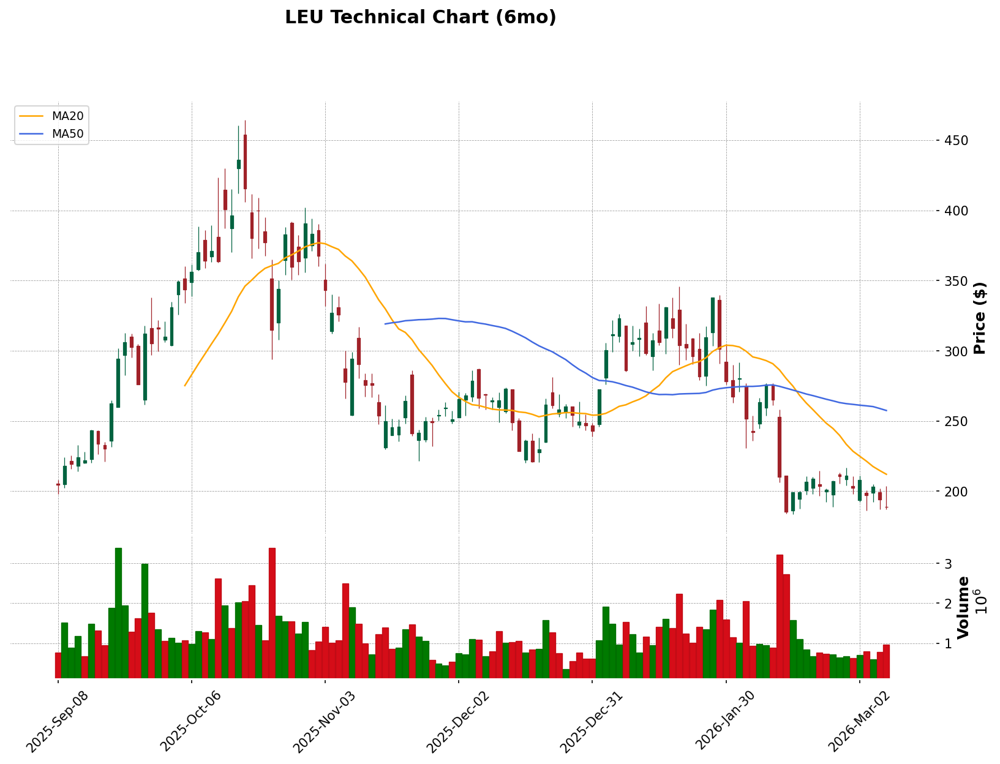

# Technical Analysis Report: LEU (2026-03-09)

## 📊 Technical Analysis Chart

**Chart File**: `LEU_tech_2026-03-09.png` (stored in the same folder as this report)

**Chart Description**:
- 🕯️ Candlestick chart showing price action
- 🟠 MA20 (Short-term MA)
- 🔵 MA50 (Medium-term MA)
- 🔴 MA200 (Long-term MA)
- 📊 Volume bars below

> **Data Sources**: yahoo_finance
> **Analysis Date**: 2026-03-09

---

## I. Layer 1 Framework Overview (Foundation Framework)

Based on the "Trend > Cost > Participation > Capital Flow" hierarchical analysis:

| Analysis Item | Tool | Current State | Consistency |
|:---|:---|:---|:---:|
| 1️⃣ Trend Direction | Three MAs (20/50/200 MA) | Bearish alignment (Price < 20 < 200 < 50) | 🔴 |
| 2️⃣ Cost Zone Position | Volume Profile / POC | Price broke below primary cost zone ($240-250) | 🔴 |
| 3️⃣ Participation | Volume | Steady on the way down, no exhaustion signal yet | ⚠️ |
| 4️⃣ Capital Flow Direction | OBV | Clearly declining, capital outflow | 🔴 |

**Framework Summary**: Systemic bearishness in the short-to-medium term. LEU is in a clear distribution phase after its parabolic run earlier in the year. All structural layers are currently negative.

---

## II. Weekly Candlestick Analysis (Long-Term Trend)

### Trend Overview
- Weekly trend: Primary downtrend within long-term uptrend.
- 200MA: $245.00 (Falling below, long-term support broken)
- 50MA: $257.48 (Acting as major overhead resistance)

### Key Price Levels
- Weekly resistance: $245 - $260 (Convergence of 200MA/50MA)
- Weekly support: $135 - $150 (Major base from 2025)

---

## III. Daily Candlestick Analysis (Medium-Term Structure)

### Moving Average Alignment
- 20MA: $212.09
- 50MA: $257.48
- 200MA: $245.00
- Alignment state: Bearish (Death cross of 50MA below 200MA is imminent or occurring)

### Support & Resistance Analysis
| Type | Price Zone | Strength | Description |
|:---|:---|:---|:---|
| Resistance 1 | $212 | 🟡 Weak | 20-day moving average |
| Resistance 2 | $245 | 🔴 Strong | 200-day moving average / Structural resistance |
| Support 1 | $180 | 🟡 Weak | Psychological support / Recent low |
| Support 2 | $150 | 🔴 Strong | Long-term structural floor |

---

## VIII. Comprehensive Assessment & Trading Recommendations

### Technical Summary
- 🔴 Overall trend: Bearish.
- 🌊 Market structure: Liquidity Contraction / De-risking.
- Key observations: LEU has undergone a massive >50% correction from its 52-week high ($436). It has failed to hold the critical 200-day moving average and is searching for a bottom.

### Trading Strategy (Incorporating Market Context & Microstructure)

| Item | Price Zone | Condition / Description | Strategy Type |
|:---|:---|:---|:---|
| 🎯 Target Price | $240 | Mean reversion to 200MA | Recovery Play |
| 🟢 Buy Zone | $150 - $170 | Accumulate near major long-term base | Structural Value |
| 🔴 Stop-Loss | $135 | Weekly close below $135 | Capitulation |

### Scenario Analysis

**Scenario A: 200MA Recovery** 🟡
- Probability: Low (Short-term)
- Trigger: Price reclaims $215 and then $245 on high volume.
- Action: Shift to neutral; initiate momentum trades for recovery.

**Scenario B: Slide to $150** 🔴
- Probability: High
- Trigger: Continued inability to close above the 20MA ($212).
- Action: Wait for $150 base formation before initiating long-term positions.

---

*Disclaimer: This report is for reference only and does not constitute investment advice.*
