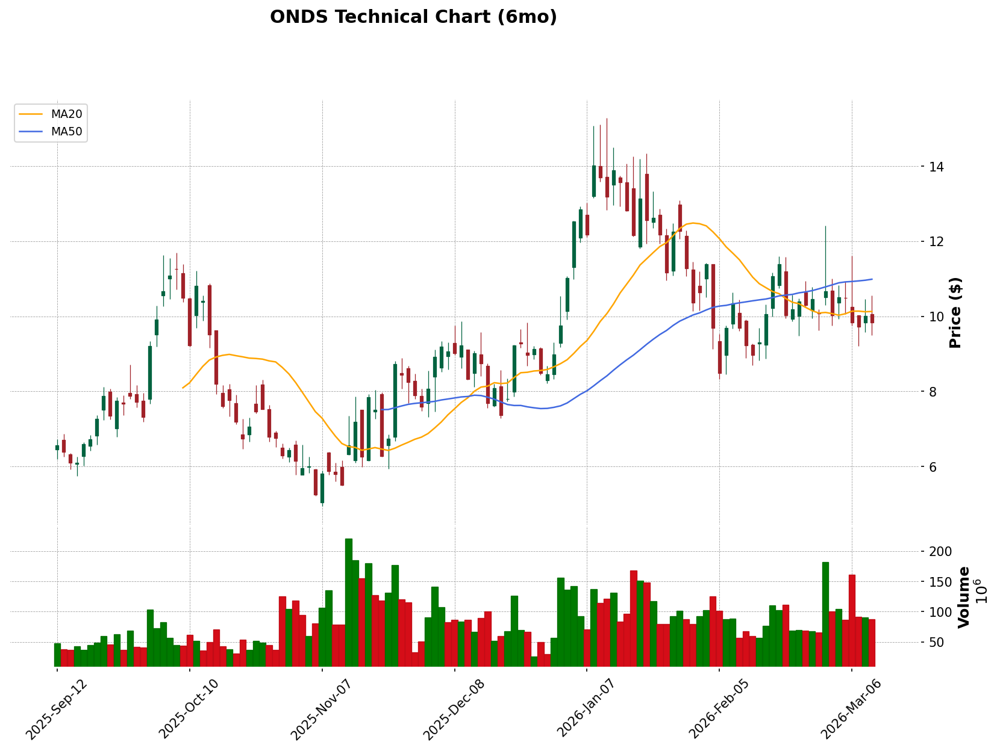

# Technical Analysis Report: ONDS (2026-03-12)

## 📊 Technical Analysis Chart

**Chart File**: `ONDS_tech_2026-03-12.png` (stored in the same folder as this report)

**Chart Description**:
- 🕯️ Candlestick chart showing price action
- 🟠 MA20 (Short-term MA)
- 🔵 MA50 (Medium-term MA)
- 🔴 MA200 (Long-term MA)
- 📊 Volume bars below

> **Data Sources**: yahoo_finance
> **Analysis Date**: 2026-03-12

---

## I. Layer 1 Framework Overview (Foundation Framework)

Based on the "Trend > Cost > Participation > Capital Flow" hierarchical analysis:

| Analysis Item | Tool | Current State | Consistency |
|:---|:---|:---|:---:|
| 1️⃣ Trend Direction | Three MAs (20/50/200 MA) | Pullback / Consolidation (Price < 20 < 50, but > 200) | ⚠️ |
| 2️⃣ Cost Zone Position | Volume Profile / POC | Consolidating below recent highs | ⚠️ |
| 3️⃣ Participation | Volume | Shrinking volume during pullback | 🟡 |
| 4️⃣ Capital Flow Direction | OBV | Flat to slightly down during consolidation | 🟡 |

**Framework Summary**: ONDS is in a major digestion phase after a historically explosive run (+1252% over the last year). Short-term and medium-term momentum has waned, breaking below the 20-day and 50-day moving averages, but the macro structural trend remains firmly bullish above the 200-day moving average.

---

## II. Weekly Candlestick Analysis (Long-Term Trend)

### Trend Overview
- Weekly trend: Pullback within a massive parabolic uptrend.
- 200MA: $6.70 (Rising sharply, long-term support)
- 50MA: $10.99 (Current medium-term resistance)

### Key Price Levels
- Weekly resistance: $14.01 (52-week high)
- Weekly support: $6.70 (200MA) - $8.00 (Structural floor)

---

## III. Daily Candlestick Analysis (Medium-Term Structure)

### Moving Average Alignment
- 20MA: $10.13
- 50MA: $10.99
- 200MA: $6.70
- Alignment state: Bearish Short-Term (Death cross of 20MA below 50MA is forming), Bullish Long-Term.

### Support & Resistance Analysis
| Type | Price Zone | Strength | Description |
|:---|:---|:---|:---|
| Resistance 1 | $10.13 | 🔴 Strong | 20-day moving average |
| Resistance 2 | $10.99 | 🔴 Strong | 50-day moving average |
| Support 1 | $9.50 | 🟡 Weak | Recent consolidation floor |
| Support 2 | $6.70 | 🔴 Strong | 200-day moving average |

### Momentum Indicator Combination

| Indicator Type | Selected Indicator | Value | Signal |
|:---|:---|:---|:---|
| Trend Indicator | MACD (12,26,9) | Histogram slightly negative | Weakening momentum |
| Oscillator | RSI (14) | ~46.27 | Neutral, leaning oversold |

> 💡 **Indicator Combination Rationale**: For high-beta, parabolic runners like ONDS (Beta ~2.58), momentum oscillators quickly reset during sideways action. The focus is strictly on moving averages as primary support/resistance zones to gauge where institutional and retail buyers re-enter.

---

## VIII. Comprehensive Assessment & Trading Recommendations

### Technical Summary
- 🟡 Overall trend: Short-term bearish, Long-term heavily bullish.
- ⚡ Market structure: Transition / Consolidation phase.
- Key observations: ONDS went from a penny stock ($0.68) to $14.01 in a year. A 30% pullback to $9.83 is entirely healthy and expected. It is currently oscillating sideways, trying to establish a new base.

### Trading Strategy (Incorporating Market Context & Microstructure)

| Item | Price Zone | Condition / Description | Strategy Type |
|:---|:---|:---|:---|
| 🎯 Target Price | $14.00 | Retest of 52-week highs | Momentum Re-acceleration |
| 🟢 Buy Zone | $7.00 - $8.50 | Deep pullback into the 200MA / Value zone | Structural Dip-Buying |
| 🔴 Stop-Loss | $6.00 | Daily close below $6.00 | Breakdown below 200MA signifies macro trend failure |

### Scenario Analysis 

**Scenario A: Reclaim of 50MA** 🟢
- Probability: Medium
- Trigger: Price pushes and closes strongly above $11.00 on high volume.
- Action: Momentum traders can enter for a swing to $14.00.

**Scenario B: Deep Pullback to 200MA** 🟡
- Probability: High
- Trigger: Continued bleed below $9.50, drifting towards $7.00-$8.00.
- Action: Wait for the 200MA to catch up and provide structural support before taking long-term positions.

---

*Disclaimer: This report is for reference only and does not constitute investment advice.*
