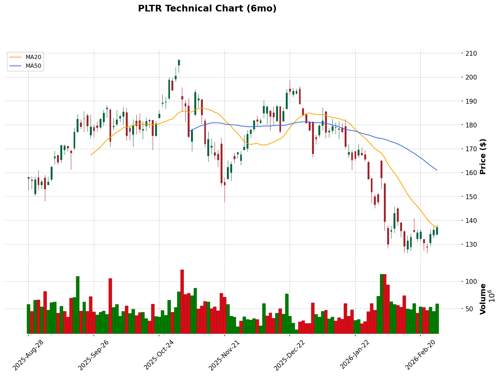

> 🔄 翻譯來源：`../PLTR_tech_2026-03-02.md` | 日期：2026-03-02

# 技術分析報告：PLTR (Palantir Technologies Inc.)

**分析日期：** 2026-03-02  
**目前股價：** $137.19 (+0.92%)  
**產業板塊：** Technology — Software - Infrastructure（科技 — 軟體 - 基礎設施）  
**市值 (Market Cap)：** $328.11B  
**Beta 值：** 1.687

> **資料來源：** yahoo_finance  
> **重要事件：** 近期無重大事件

---

## 📊 技術分析圖表

**圖表檔案：** `PLTR_tech_2026-03-02.png`

**圖表說明：**
- 🕯️ K線圖顯示 6 個月價格走勢
- 🟠 MA20（短期均線）：$137.08
- 🔵 MA50（中期均線）：$161.07
- 🔴 MA200（長期均線）：$161.50
- 📊 下方成交量柱狀圖

---

## I. Layer 1 架構總覽（基礎框架）

基於「趨勢 (Trend) > 成本 (Cost) > 參與度 (Participation) > 資金流向 (Capital Flow)」階層式分析：

| 分析項目 | 工具 | 目前狀態 | 一致性 |
|:---|:---|:---|:---:|
| 1️⃣ **趨勢方向 (Trend Direction)** | 三條均線 (20/50/200 MA) | 偏空排列 — 股價低於 50MA 與 200MA；20MA ≈ 股價 | ⚠️ |
| 2️⃣ **成本區間位置 (Cost Zone Position)** | 成交量分布 (Volume Profile) / POC | 股價低於歷史 POC（約 $160-170 區間） | 🔴 |
| 3️⃣ **參與度 (Participation)** | 成交量 (Volume) | 下跌時成交量放大（出貨跡象） | ⚠️ |
| 4️⃣ **資金流向 (Capital Flow Direction)** | OBV（能量潮指標）| OBV 走低 — 資金流出 | 🔴 |

**延伸分析（市場與籌碼面）：**

| 分析項目 | 關鍵觀察 | 目前狀態 |
|:---|:---|:---|
| 📊 **市場相關性 (Market Correlation)** | 個股與 SPY/QQQ 比較 | 逆勢弱勢 — PLTR 年初至今下跌 -22.8%，而 SPY 上漲 +0.6% |
| 🎲 **機構成本 (Institutional Cost)** | POC / 價值區間 (Value Area) | 機構目前處於套牢狀態 |
| 🎲 **籌碼集中度 (Position Concentration)** | 成交量分布形態 | 出貨模式 — 下跌時成交量放大 |
| 🎲 **換手率趨勢 (Turnover Trend)** | 近期與歷史平均比較 | 下跌時換手率升高，現已趨緩 |

**框架總結：** 🔴 **四個 Layer 1 指標中有三個與看漲論點矛盾。** 股價低於關鍵均線、低於估算 POC，且 OBV 顯示資金流出。這是**過渡/潛在築底階段**，尚未確認為上升趨勢。

---

## II. 週線 K線分析（長期趨勢）

### 趨勢概覽
- **週線趨勢：** 🔴 偏空 — 股價低於 20週 MA（$167.91）且遠離近期高點
- **200MA：** 無法取得（週線歷史資料不足）
- **50MA：** $150.38 — 作為上方壓力

### 關鍵價位
- **週線壓力：** $150-$160（前期盤整區）
- **週線支撐：** $125-$130（近期低點，關鍵守衛區）

### 型態觀察
- 從 1 月高點（$188+）形成明確**下跌通道**
- 近期從 $126 區間反彈顯示暫時支撐
- 週線 RSI 為 40.8 — 中性偏空，仍有下跌空間

**週線關鍵指標摘要：**

| 指標 | 數值 | 趨勢判讀 |
|:---|:---|:---|
| 20週 MA | $167.91 | 長期壓力 |
| 50週 MA | $150.38 | 中期壓力 |
| 本週收盤價 | $137.19 | 低於所有關鍵均線 |
| 週線成交量 | 304M | 下跌時成交量放大 |
| 週線 RSI (14) | 40.8 | 中性偏空 |

---

## III. 日線 K線分析（中期結構）

### 均線排列
- **20MA：** $137.08 — 股價貼近此價位（即時轉折點）
- **50MA：** $161.07 — **較目前股價高出 -14.8%**（重大壓力）
- **200MA：** $161.50 — 與 50MA 匯聚，形成強大壓力帶
- **排列狀態：** 🔴 偏空 — 股價 < 20MA ≈ 50MA < 200MA（下降排列）

### 支撐與壓力分析

| 類型 | 價格區間 | 強度 | 說明 |
|:---|:---|:---|:---|
| 壓力 1 | $150 | 🔴 強 | 前期盤整區底部，現為天花板 |
| 壓力 2 | $161 | 🔴 強 | 50MA/200MA 匯聚處 |
| 支撐 1 | $133 | 🟡 弱 | 近期波段低點 |
| 支撐 2 | $126-$128 | 🔴 強 | 1 月恐慌低點 — 跌破將下探 $100 |

### 動能指標組合

**針對 PLTR（AI/高波動科技股）選用的指標組合：** KDJ + MACD + MFI + MA 帶狀指標 (MA Ribbon)

| 指標類型 | 選用指標 | 數值 | 訊號 |
|:---|:---|:---|:---|
| 趨勢指標 (Trend Indicator) | MACD (12,26,9) | DIF: -7.53, DEA: -9.04 | 🟢 黃金交叉形成中（柱狀圖轉正） |
| 震盪指標 (Oscillator) | RSI (14) | 43.0 | 中性 — 雙向皆有空間 |
| 震盪指標 (Oscillator) | KDJ (9,3,3) | K: 55.5, D: 43.0 | 🟢 K 線上穿 D 線（短期偏多） |
| 波動率指標 (Volatility Indicator) | 布林通道 (Bollinger Bands) (20,2) | 中軌: $137.08, 帶寬: 20.9% | 壓縮形成中 — 波動率收斂 |
| 成交量指標 (Volume Indicator) | MFI (14)（資金流量指標） | 50.7 | 資金流量中性 |
| 資金流向指標 (Capital Flow Indicator) | Net Volume Bars（淨成交量柱） | 正值: +44.9M | 🟢 近期有吸籌跡象 |
| 波動率指標 (Volatility Indicator) | ATR (14)（真實波幅） | $6.83 | 偏高 — 預期每日波動超過 $10 |

> 💡 **指標組合邏輯：** PLTR 是高波動 AI 股，具有爆發性走勢。KDJ 捕捉短期反轉，MACD 確認趨勢方向，MFI 確認真實資金流向，而 ATR 對於該股波動性下的停損設置至關重要。

---

## IV. 市場基準與個股比較（市場情境）

### 4.1 市場趨勢概覽

| 市場指數 | 目前價格 | 趨勢 | 20MA | 50MA | 年初至今變化 |
|:---|:---|:---:|:---:|:---:|:---:|
| **SPY**（S&P 500） | $685.99 | 🟡 中性 | 低於 | 低於 | +0.60% |
| **QQQ**（那斯達克 100） | $607.29 | 🔴 弱勢 | 低於 | 低於 | -1.14% |
| **XLK**（科技板塊） | $138.76 | 🔴 弱勢 | 低於 | 低於 | -3.62% |

**整體市場評估：** 🟡 **震盪/過渡階段**
- S&P 500 年初至今持平，在 20MA 與 200MA 之間交易
- 那斯達克表現落後，年初至今下跌 -1.14%
- 科技板塊（XLK）最弱，年初至今下跌 -3.62%

### 4.2 個股與市場比較

**可比較期間報酬率：**

| 代號 | 年初至今報酬率 | 與 PLTR 比較 | 表現 |
|:---|:---:|:---:|:---|
| PLTR | -22.82% | 基準 | — |
| SPY | +0.60% | 超越 +23.4% | 強勢許多 |
| QQQ | -1.14% | 超越 +21.7% | 較強 |
| XLK | -3.62% | 超越 +19.2% | 較強 |

**估算 Beta 值：** ~1.69
- PLTR 波動約為市場的 1.7 倍 — 確認高波動性
- 近期跌幅因高 Beta + 板塊弱勢而放大

### 4.3 順勢/逆勢評估

| 比較項目 | 個股 | 市場 | 一致性 |
|:---|:---:|:---:|:---:|
| 短期趨勢（4小時） | 盤整 | 震盪 | 相同 |
| 中期趨勢（日線） | 下跌 | 下跌/橫盤 | 相同 |
| 長期趨勢（週線） | 下跌 | 上漲（SPY > 200MA）| 🔴 **相反** |

**整體評估：** 🔴 **逆勢弱勢**

- 市場（SPY）仍處長期上升趨勢（高於 200MA）
- PLTR 處於急劇下跌趨勢，從 52 週高點下跌 -33.8%
- 這是**逆勢弱勢** — 市場撐住但個股崩跌
- 高風險格局：若市場反轉，高 Beta 的 PLTR 可能加速下跌

### 4.4 板塊相對強勢

| 代號 | 年初至今表現 | 相對強勢 | 判讀 |
|:---|:---:|:---:|:---|
| PLTR | -22.82% | — | 基準 |
| XLK（板塊） | -3.62% | 超越 +19.2% | 板塊落後者 |
| SPY（市場） | +0.60% | 超越 +23.4% | 市場落後者 |

**板塊定位：** 🔴 **板塊落後者、市場落後者**
- PLTR 同時落後於所屬板塊與大盤
- 兩者皆輸的局面 — 無避險地位

---

## V. 4小時 K線分析（短期動能）

### 短期趨勢
- **短期趨勢：** 🟡 盤整/築底
- **關鍵價位：** 支撐 $128-$133 / 壓力 $140-$145
- **市場相關性：** 4小時圖顯示在市場震盪時相對穩定

### 短期動能指標評估

根據近期小時資料型態：

- **從 $126 反彈：** 強勁成交量反轉 — 可能是短期底部
- **目前區間：** $133-$140 盤整區
- **下一個觸發：** 突破 $140 → 目標 $150；跌破 $130 → 目標 $115-$120

### 短線進出場參考

| 條件 | 價格 | 條件說明 | 指標確認 |
|:---|:---|:---|:---|
| 🟢 短線多單進場 | $140+ | 突破區間 | 成交量放大 + MACD 確認 |
| 🔴 短線空單進場 | $128- | 跌破支撐 | ATR 停損設於 $135 |
| ⏹️ 多單停損 | $125 | 低於恐慌低點 | 1.5×ATR = ~$10 |

> 💡 **短線交易提醒：** 4 小時圖顯示 PLTR 嘗試築底。$126 低點至關重要 — 失守將開啟重大下行空間。反彈可參與但需嚴格停損。

---

## VI. 籌碼面分析（市場微觀結構）

### 6.1 成交量分布深度分析

**成交量分布概覽（過去 60 日）：**

| 指標 | 價位 | 說明 |
|:---|:---|:---|
| **估算 POC** | $160-$170 | 機構大量吸籌區間（2025年11-12月） |
| **價值區間高點 (VAH)** | $180 | 上方出貨區 |
| **價值區間低點 (VAL)** | $140 | 價值區間下緣 |
| **目前股價** | $137 | **低於 VAL** — 機構套牢 |

**成交量分布形態：** 出貨型態
- 從 $180+ 高點下跌時成交量放大 → 機構出貨
- $126 成交量激增 → 可能是恐慌性拋售
- 近期成交量降低盤整 → 籌碼沉澱

**關鍵高量節點 (HVN)：**
1. $160-$170：主要機構成本區（反彈時的壓力）
2. $140：前期支撐，現為次要壓力
3. $126-$130：近期支撐群集

> 💡 **機構成本區估算：** 目前股價（$137）**低於**估算 POC（$160-170），顯示 11-12 月進場的機構目前處於套牢狀態。這在反彈時將形成上方賣壓。

### 6.2 換手率分析

| 指標 | 數值 | 判讀 |
|:---|:---|:---|
| 日換手率 | ~1.4% | 以大型股而言屬活躍 |
| 型態 | 下跌時放大 | 出貨特徵 |
| 近期成交量 | 趨緩 | 恐慌後籌碼沉澱 |

**籌碼穩定性評估：**
- 成交量從恐慌水準下降 — 顯示賣壓正在耗盡
- 然而，低成交量反彈 = 缺乏信心買盤

### 6.3 機構控盤程度評估

| 維度 | 狀態 | 說明 |
|:---|:---|:---|
| 成交量分布集中度 | 中等 | $160-170 前期集中，現已分散 |
| 換手率趨勢 | 下降 | 從恐慌到盤整 |
| 股價相對 POC | 低於 | 機構套牢 |

**整體評估：** 🟡 **機構控盤程度中低**
- 機構從 $180+ 高點出貨
- 目前價位顯示一定支撐但非強勁吸籌
- 留意下次反彈時的成交量型態

> ⚠️ **資料限制：** 完整籌碼面分析需要 Level 2 逐筆資料。本分析基於成交量分布推論，僅供參考。

---

## VII. 市場結構評估

### 7.1 流動性狀態判定
**目前狀態：** 🏜️ **流動性收縮 (Liquidity Contraction) / 過渡期**

**評估依據：**
- 突破成功率：**低** — 多次跌破 $140 的假突破
- 趨勢延續性：**弱** — 從 $188 高點急劇反轉
- 假突破頻率：**高** — $150 支撐變為壓力
- 價量配合：**背離** — 反彈時缺乏成交量跟進

### 7.2 市場格局分析

| 評估項目 | 狀態 | 說明 |
|:---|:---|:---|
| 整體格局 | 🟡 **結構型 (Structure-Dependent)** | 區間震盪，關鍵價位攻防 |
| 趨勢效率 | 低 | 走勢無法持續 |
| 回歸均值頻率 | 高 | 極端價位快速反轉 |
| 延續能力 | 弱 | 突破/跌破皆失敗 |

### 7.3 獲利效率觀察
**近期價格行為分析：**
- 突破成功率：~30%（差）
- 平均趨勢延續：3-5 根 K 線後反轉
- 假突破頻率：**偏高**

### 7.4 策略適配建議
**適合策略類型：** 🎯 **結構型佈局 (Structural positioning) / 區間交易**

**具體建議：**
- ✅ **建議：** 等待關鍵價位測試，在區間外設停損佈局
- ⚠️ **謹慎：** 追突破 — 目前格局失敗率高
- ❌ **避免：** FOMO 進場，無確認的動能追價

> ⚠️ **關鍵：** 我們正處於流動性收縮階段。順勢策略正在受懲罰。偏好均值回歸與關鍵價位佈局，直到明確趨勢重新出現。

---

## VIII. 綜合評估與交易建議

### 技術面摘要
- 🔴 **整體趨勢：** 偏空 — 低於所有關鍵均線，處於既定下跌趨勢
- 📊 **市場相關性：** 逆勢弱勢 — 大幅落後 SPY/QQQ
- 🏜️ **市場結構：** 流動性收縮 — 假突破風險升高
- 🎲 **籌碼面狀態：** 機構套牢，出貨型態明顯
- **關鍵觀察：**
  - $126-$130 關鍵支撐必須守住
  - $150-$161 重大壓力（50MA/200MA）
  - MACD 顯示早期築底跡象（柱狀圖翻揚）
  - 高 Beta（1.69）意味雙向波動皆會放大

### 市場與板塊定位
- **市場趨勢：** SPY 中性/弱勢，對 PLTR 的影響**因高 Beta 而放大**
- **個股相對強勢：** 較市場**落後 23.4% 年初至今** — 表現最差等級
- **板塊定位：** 在科技股中，PLTR 為**板塊落後者**
- **趨勢一致性：** 🔴 逆勢弱勢
  - 市場持平/上漲但 PLTR 崩跌 = 個股特定出貨
  - 若市場反轉風險極高（Beta 放大效應）

### 籌碼面摘要
- **機構成本區：** 估算 POC $160-170，目前股價 $137（套牢）
- **籌碼集中度：** 從高點分散，尚未重新吸籌
- **換手率狀態：** 下跌時升高，現已沉澱

### 市場結構摘要
目前正處於**流動性收縮格局**，趨勢效率低落。突破失敗率高。偏好耐心與關鍵價位佈局，而非追價動能。

### 交易策略（綜合市場情境與籌碼面）

| 項目 | 價格區間 | 條件/說明 | 策略類型 | 市場/籌碼面考量 |
|:---|:---|:---|:---|:---|
| 🎯 目標價 1 | $150 | 放量突破 $140 | 波段 | 測試 50MA，供給區 |
| 🎯 目標價 2 | $161 | 重大均線匯聚 | 部位 | 強大壓力，獲利區 |
| 🟢 買進區間 | $128-$133 | 接近恐慌低點 | 累積 | 若停損設於 $125 則風險報酬比佳 |
| 🟡 觀察價位 | $140 | 區間突破觸發 | 確認 | 需要成交量驗證 |
| 🔴 停損價 | $125 | 低於 $126 恐慌低點 | 風險管理 | 1.5×ATR 緩衝 |

**部位規模提醒：** 鑑於 ATR $6.83 與高 Beta，部位規模應為**正常的 50-60%** 以應對波動性。

### 情境分析（綜合市場情境）

**情境 A：市場上漲 + PLTR 順勢上漲** 🟢
- **機率：** 中等（30%）
- **觸發：** SPY 突破 $695 + PLTR 突破 $150
- **行動：** 確認突破後加碼，目標 $170-$180

**情境 B：市場下跌 + PLTR 逆勢抗跌** 🟡
- **機率：** 低（15%）
- **觸發：** SPY 回檔但 PLTR 守住 $130
- **行動：** 相對強勢操作，小部位

**情境 C：市場上漲 + PLTR 逆勢弱勢** 🔴
- **機率：** 中高（40%）
- **觸發：** SPY 上漲但 PLTR 在 $150 失敗
- **行動：** 避開 — 出貨型態持續

**情境 D：市場下跌 + PLTR 順勢下跌** 🔴
- **機率：** 中等（25%）
- **觸發：** 科技股全面回檔，PLTR 失守 $126
- **行動：** 避開或避險 — $100-$110 成為目標

### 風險警示

**一般風險：**
- ⚠️ 高波動性（ATR $6.83）— 預期每日波動 5-10%
- ⚠️ Beta 1.69 — 市場波動放大 1.7 倍
- ⚠️ 高本益比（P/E 217x）— 對利率/總體變化敏感

**市場相關性風險：**
- 📊 PLTR 與科技股情緒**高度相關**；QQQ 反轉將直接影響
- 📊 目前處於**逆勢弱勢**狀態 — 市場上漲但個股下跌
- 📊 Beta ~1.69；SPY 1% 波動可能轉化為 PLTR ~1.7% 波動

**籌碼面相關風險：**
- 🎲 $160-170 機構套牢盤的上方賣壓
- 🎲 成交量分布資料有限；POC 為估算值
- 🎲 出貨型態顯示需要更多盤整

**結構相關風險：**
- 🏜️ 流動性收縮期間，假突破風險升高
- 🏜️ 趨勢延續性降低；需要更緊的停損
- 🏜️ 避免追價進場；有淪為流動性提供者的風險

---

## 選擇權市場觀察

**最近到期日：** 2026年3月6日（4天後）

| 項目 | 數值 | 判讀 |
|:---|:---|:---|
| 平價隱含波動率 (ATM IV) | ~60-65% | **偏高** — 選擇權昂貴 |
| 買權/賣權活動 | $140+ 履約價買權成交量大 | 反彈偏多佈局 |
| 最大買權未平倉量履約價 | $140 | 上方壓力目標 |
| 賣權避險 | $130、$124 履約價活躍 | 下行避險已佈局 |

**選擇權策略含義：**
- IV 偏高 — **偏好賣方而非買方**
- 若預期區間：Iron Condor（$125-$150）
- 若單向：等待事件後 IV 下降或使用價差降低權利金

---

*免責聲明：本報告僅供參考，不構成投資建議。技術分析代表機率而非確定性。過去型態不保證未來結果。*