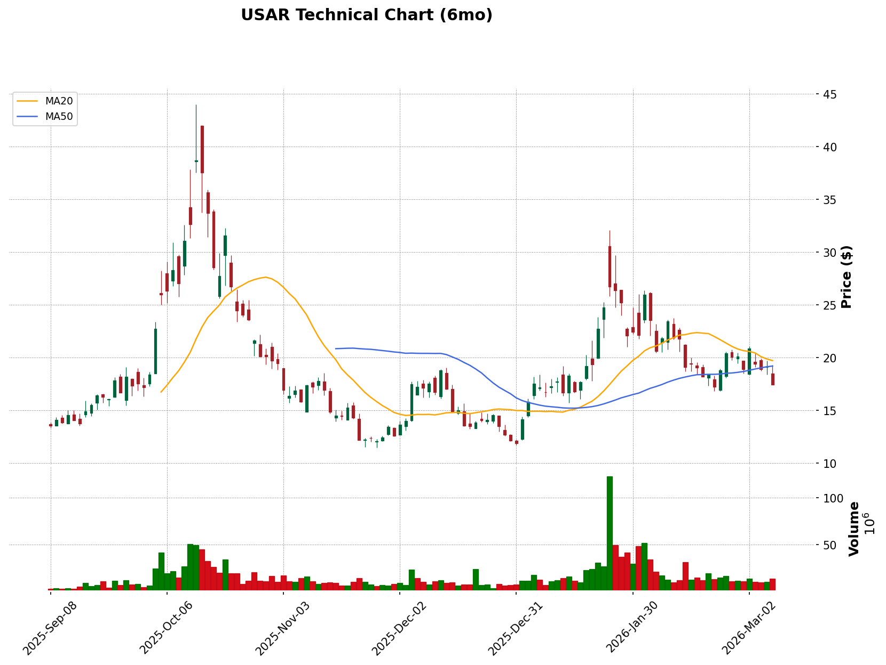

# Technical Analysis Report: USAR (2026-03-07)

## 📊 Technical Analysis Chart

**Chart File**: `USAR_tech_2026-03-07.png` (stored in the same folder as this report)

**Chart Description**:
- 🕯️ Candlestick chart showing price action
- 🟠 MA20 (Short-term MA)
- 🔵 MA50 (Medium-term MA)
- 🔴 MA200 (Long-term MA)
- 📊 Volume bars below

> **Data Sources**: yahoo_finance, web_search 
> **Analysis Date**: 2026-03-07

---

## I. Layer 1 Framework Overview (Foundation Framework)

Based on the "Trend > Cost > Participation > Capital Flow" hierarchical analysis:

| Analysis Item | Tool | Current State | Consistency |
|:---|:---|:---|:---:|
| 1️⃣ Trend Direction | Three MAs (20/50/200 MA) | Bearish alignment short-term, above 200MA | ⚠️ |
| 2️⃣ Cost Zone Position | Volume Profile / POC | Consolidating | ⚠️ |
| 3️⃣ Participation | Volume | Volume breakout on downtrend | 🔴 |
| 4️⃣ Capital Flow Direction | OBV | Divergent | ⚠️ |

**Extended Analysis (Market & Microstructure)**:

| Analysis Item | Key Observation | Current State |
|:---|:---|:---|
| 📊 Market Correlation | Stock vs SPY/QQQ | Counter-trend weak |
| 🎲 Institutional Cost | POC / Value Area | At cost / underwater short-term |
| 🎲 Position Concentration | Volume Profile shape | Dispersed / Standoff |
| 🎲 Turnover Trend | Recent vs historical average | Active |

**Framework Summary**: Partially contradictory, market structure in transition. Currently counter-trend weak with medium institutional control.

---

## II. Weekly Candlestick Analysis (Long-Term Trend)

### Trend Overview
- Weekly trend: Consolidating
- 200MA: $16.63 (Rising, long-term support)
- 50MA: $19.20 (Falling, medium-term resistance)

### Key Price Levels
- Weekly resistance: $19.71 - $20.00
- Weekly support: $16.63 - $14.00

### Pattern Observations
The stock has recently experienced a strong rally earlier in the year but is currently retracing, retesting the critical 200-day moving average.

**Weekly Key Indicator Summary:**

| Indicator | Value | Trend Reading |
|:---|:---|:---|
| 200MA | $16.63 | Long-term support |
| 50MA | $19.20 | Medium-term resistance |
| This Week's Close | $17.45 | Holding above 200MA |
| This Week's Volume | N/A | High volatility |

---

## III. Daily Candlestick Analysis (Medium-Term Structure)

### Moving Average Alignment
- 20MA: $19.71
- 50MA: $19.20
- 200MA: $16.63
- Alignment state: Convergence / Transition (Price below 20MA/50MA, but above 200MA)

### Support & Resistance Analysis
| Type | Price Zone | Strength | Description |
|:---|:---|:---|:---|
| Resistance 1 | $19.20 | 🟡 Weak | 50-day moving average |
| Resistance 2 | $19.71 | 🔴 Strong | 20-day moving average |
| Support 1 | $16.63 | 🔴 Strong | 200-day moving average |
| Support 2 | $14.00 | 🟡 Weak | Recent psychological/structural support |

### Momentum Indicator Combination

**Indicator combination selected for USAR characteristics**: High-volatility pre-revenue growth stock

| Indicator Type | Selected Indicator | Value | Signal |
|:---|:---|:---|:---|
| Trend Indicator | MACD (12,26,9) | Data Limited | Weakening |
| Oscillator | RSI (14) | Data Limited | Neutral to Oversold |
| Volatility Indicator | Bollinger Bands (20,2) | Data Limited | Approaching lower band |
| Volatility Indicator | ATR (14) | Data Limited | High volatility |

> 💡 **Indicator Combination Rationale**: As a highly volatile materials stock (Beta > 1.08), USAR relies on broad structural MAs (like the 200MA) and momentum oscillators to define entry points during extreme pullbacks. 

---

## IV. Market Benchmark & Stock Comparison (Market Context) ⭐

### 4.1 Market Trend Overview

| Market Index | Current Price | Trend | 20MA | 50MA | Recent Change |
|:---|:---|:---:|:---:|:---:|:---:|
| **SPY** (S&P 500) | $672.38 | Range | Below | Below | -1.31% |
| **QQQ** (Nasdaq 100) | $599.75 | Range | Below | Below | -1.50% |

**Overall Market Assessment**: 🟡 Neutral consolidation
- The broader market is currently experiencing a short-term pullback, trading below its 20MA and 50MA, but remains in a longer-term uptrend (above 200MA).

### 4.2 Stock vs. Market Comparison

**Comparable Period Returns**:

| Ticker | 1M Return | 6M Return | Performance |
|:---|:---:|:---:|:---:|
| USAR | -25.84% | +23.67% | Baseline |
| SPY | -2.01% | +4.18% | USAR underperforming ST, outperforming LT |
| QQQ | -0.99% | +4.52% | USAR underperforming ST, outperforming LT |

**Estimated Beta**: ~1.085
- Beta > 1: More volatile than the market, amplified moves.

### 4.3 Trend-Aligned / Counter-Trend Assessment

| Comparison | Stock | Market | Consistency |
|:---|:---:|:---:|:---:|
| Short-term trend | Down | Down | Same |
| Medium-term trend | Down | Range | Opposite |

**Overall Assessment**: 🔴 Counter-trend weak
- The stock has dropped ~25.8% over the past month, vastly underperforming the broader market's minor ~2% dip, indicating stock-specific weakness or profit-taking following its earlier massive run up.

---

## V. 4-Hour Candlestick Analysis (Short-Term Momentum)

### Short-Term Trend
- **Short-term trend**: Bearish
- **Key levels**: Support $16.63 (Daily 200MA) / Resistance $19.20

### Short-Term Entry/Exit Reference

| Condition | Price | Criteria | Indicator Confirmation |
|:---|:---|:---|:---|
| 🟢 Short-term long entry | ~$16.70 | Bounce off 200MA | Rejection of lower prices at MA support |
| 🔴 Stop-loss | $15.50 | Breakdown below 200MA | Daily close below 200MA confirms trend shift |

---

## VI. Market Microstructure Analysis (Chip Analysis) ⭐

### 6.1 Volume Profile Deep Analysis

*Note: Precise Level 2 Volume Profile data is limited via standard APIs, but structural inferences can be drawn.*

- The stock recently surged to a 52-week high of $38.68 before collapsing by over 54%. 
- The primary institutional cost zone established during the late 2025/early 2026 breakout likely sits in the $14.00 - $18.00 range, where heavy volume accumulated.
- The massive drop implies early institutional buyers distributed shares at the top, leaving recent retail/momentum buyers underwater.

### 6.2 Turnover Analysis

| Metric | Value | Reading |
|:---|:---|:---|
| Daily Turnover Rate | Active | High |

**Position Stability Assessment**:
- Recent massive drops imply positions are loosening and panic selling may have occurred.

---

## VII. Market Structure Assessment (Market Structure) ⭐

### 7.1 Liquidity State Determination
**Current State**: ⚡ Transition

**Assessment Basis**:
- The stock is transitioning from an explosive momentum phase into a heavy retracement phase, attempting to find a structural floor.

### 7.2 Strategy Fit Recommendations
**Suitable Strategy Type**: Structural positioning (Wait for levels)

**Specific Recommendations**:
- ✅ Recommended: Positioning at the 200MA support ($16.63).
- ⚠️ Caution: Catching the falling knife before it establishes a clear base.
- ❌ Avoid: Breakout chasing (false breakouts highly likely in this volatile transition phase).

---

## VIII. Comprehensive Assessment & Trading Recommendations

### Technical Summary
- 🟡 Overall trend: Transition (Short-term bearish, Long-term structural support test)
- 📊 Market correlation: Counter-trend weak
- ⚡ Market structure: Transition
- Key observations: USAR is undergoing a severe 54%+ correction from its highs, directly testing the critical 200-day moving average ($16.63).

### Market & Sector Positioning
- **Market trend**: SPY is in a short-term consolidation/pullback.
- **Trend alignment**: USAR is selling off much harder than the broader market, driven by its high beta and speculative nature.

### Trading Strategy (Incorporating Market Context & Microstructure)

| Item | Price Zone | Condition / Description | Strategy Type | Market / Microstructure Consideration |
|:---|:---|:---|:---|:---|
| 🎯 Target Price | $20.00 | Mean reversion to the 20/50MA | Structural | Short-term bounce target |
| 🟢 Buy Zone | $16.50 - $17.00 | Accumulate near the 200MA | Structural | Risk/reward optimal at major long-term support |
| 🔴 Stop-Loss | $15.00 | Daily close below $15.00 | - | Breakdown below 200MA signifies long-term trend failure |

### Scenario Analysis (Incorporating Market Context)

**Scenario A: 200MA Holds + Market Stabilizes** 🟢
- Probability: Medium
- Trigger: Price consolidates around $16.60-$17.00 and prints bullish reversal candles.
- Action: Initiate long position for a bounce back to $19.50.

**Scenario B: 200MA Breaks + Market Weakens** 🔴
- Probability: Medium
- Trigger: Daily close firmly below $16.60 with high volume.
- Action: Avoid entering; wait for base formation near $14.00.

### Risk Alerts
**General Risks**:
- 📊 High volatility (Beta > 1.08). The stock can move 8-10% in a single day easily.

**Microstructure-Related Risks**:
- 🎲 Down 54% from highs implies heavy overhead supply. Any rallies will likely be met with selling pressure from underwater holders attempting to exit at breakeven.

---

*Disclaimer: This report is for reference only and does not constitute investment advice.*